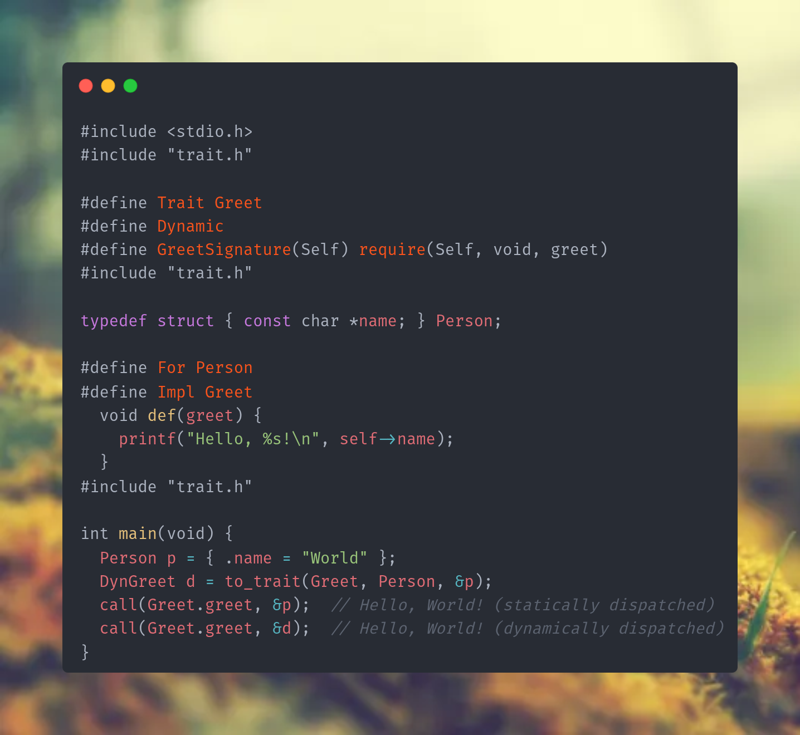

<p align="center">
  <h1 align="center">c-trait</h1>
  <p align="center">Ad-hoc polymorphism for C - statically dispatched or dynamically dispatched.</p>
</p>

<p align="center">
  
  
  <a href="LICENSE.md"></a>
  <a href="https://github.com/elias-michaias/c-trait/actions/workflows/ci.yml"></a>
  <a href="https://github.com/elias-michaias/c-trait"></a>
</p>

<p align="center">
  <a href="#quick-start">Quick Start</a> &bull;
  <a href="#features">Features</a> &bull;
  <a href="docs/API.md">API Reference</a> &bull;
  <a href="HOW_IT_WORKS.md">How It Works</a> &bull;
  <a href="#examples">Examples</a>
</p>

---



Define traits with required and default methods, implement them for your types, override defaults, and extend traits with supertraits. Works with both **static dispatch** (zero-cost, compile-time) and **dynamic dispatch** (vtable-based), unified through a single `call()` macro.

## Install

```sh
./install.sh
```

Copies `trait.h` to `~/.local/include/trait.h`.

## Quick start

```c
#include <stdio.h>
#include "trait.h"

#define Trait Greet
#define GreetSignature(Self) require(Self, void, greet)
#include "trait.h"

typedef struct { const char *name; } Person;

#define For Person
#define Impl Greet
  void def(greet) {
    printf("Hello, %s!\n", self->name);
  }
#include "trait.h"

int main(void) {
  Person p = { .name = "World" };
  call(Greet.greet, &p);  // Hello, World!
}
```

Add `#define Dynamic` before the trait declaration for vtable-based runtime polymorphism:

```c
#define Dynamic
#define Trait Greet
#include "trait.h"

// ...
Person p = { .name = "World" };
DynGreet g = to_trait(Greet, Person, &p);
call(Greet.greet, &g);  // goes through vtable
```

## Features

| Feature | Description |
|---------|-------------|
| **Static dispatch** | Default — zero runtime overhead, resolved at compile time via `_Generic` |
| **Dynamic dispatch** | Opt-in vtable support with `#define Dynamic` |
| **Unified `call()` macro** | Same syntax for both static and dynamic dispatch |
| **Default methods** | Provide fallback implementations; override per-type with `Override_` |
| **Trait inheritance** | `extends()` declares supertraits; enforced at link time |
| **Parametric traits** | Generic traits with type parameters (`Container_int`, `Container_str`) |
| **Associated types** | Specialize traits per-implementation via preprocessor defines |
| **Const methods** | `immutable()` / `constdef()` for read-only interfaces |
| **Forward declarations** | `call()` inside `def()` bodies with the `Forward` flag |
| **Header-only** | Single 2K-line header. No build system required. |
| **Portable** | C11 (GCC/Clang) or C23 (any conforming compiler) |

## Concepts

### Static vs. dynamic traits

Traits are **static by default** — no vtable, no overhead. Add `#define Dynamic` to opt in.

| | Static (default) | Dynamic (`#define Dynamic`) |
|---|---|---|
| Vtable | No | Yes |
| `to_trait` / `from_trait` | Not available | Available |
| Default methods | Supported | Supported |
| `extends()` enforcement | Linker check | Linker check |

### Unified `call()` dispatch

```c
Dog dog = { .snacks = 5 };

// Static — resolved at compile time
call(Animal.get_snacks, &dog);

// Dynamic — through vtable
DynAnimal da = to_trait(Dog, Animal, &dog);
call(Animal.get_snacks, &da);

// Same syntax, compiler picks the right path
```

## Examples

See [`examples/`](examples/) for complete, runnable demos:

| File | Topic |
|------|-------|
| [`e1_basics.c`](examples/e1_basics.c) | Trait definition, default methods, `Override_`, implementation |
| [`e2_extension.c`](examples/e2_extension.c) | Trait inheritance with `extends`, chaining, multi-base |
| [`e3_const_methods.c`](examples/e3_const_methods.c) | Immutable (const) methods via `immutable(Self)` |
| [`e4_const_extension.c`](examples/e4_const_extension.c) | Extending const traits |
| [`e5_parametric.c`](examples/e5_parametric.c) | Generic/parametric traits with type parameters |
| [`e6_static_dispatch.c`](examples/e6_static_dispatch.c) | `call()` with static dispatch vs. dynamic |
| [`e7_exhaustive.c`](examples/e7_exhaustive.c) | Comprehensive test: multiple traits, types, `extends`, `Override_`, `from_trait`, `new_trait` |
| [`e8_arity.c`](examples/e8_arity.c) | Method arity from 0 to 4 extra arguments |
| [`e9_forward_declare.c`](examples/e9_forward_declare.c) | `Forward` flag: `call()` inside `def()` bodies |
| [`e10_static_traits.c`](examples/e10_static_traits.c) | Static traits, associated types, no vtable |
| [`e11_static_defaults.c`](examples/e11_static_defaults.c) | Static traits with `default()` and `Override_` |

Build and run any example:

```sh
gcc -I. examples/e1_basics.c -o e1 && ./e1
```

## Testing

```sh
./test.sh
```

Compiles and runs all examples with `-Wall -Wextra -Werror`, verifying each exits successfully.

## Benchmarking

```sh
./benchmark.sh
```

Compiles every example to assembly at each optimization level (`-O0` through `-O3`, `-Os`) and classifies every indirect call in the generated assembly:

| Category | Pattern | Meaning |
|----------|---------|---------|
| **Fully indirect** | `callq *%reg` | Vtable pointer loaded at runtime |
| **Partial devirt** | `callq *vtable+8(%rip)` | Vtable base resolved at link time |
| **Direct (devirt)** | `callq Dog_Animal_check` | Full devirtualization — direct call |

Output: `benchmark_asm/` (assembly files) and `benchmark_report.txt` (machine-readable report).

```sh
CC=gcc ./benchmark.sh            # use a different compiler
OPT_LEVELS="-O2 -O3" ./benchmark.sh  # custom opt levels
NO_COLOR=1 ./benchmark.sh        # disable ANSI colors
```

## Documentation

| Document | Description |
|----------|-------------|
| [**API Reference**](docs/API.md) | Full API: defining traits, implementing, calling, defaults, extension, parametric traits, associated types, forward declarations |
| [**How It Works**](HOW_IT_WORKS.md) | Deep-dive into the preprocessor machinery: self-include loops, SD dispatch chain, selector objects, the octal counter trick |
