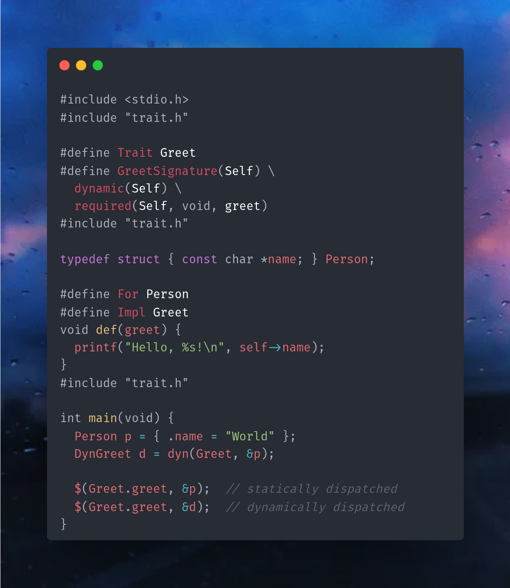

<p align="center">
  <h1 align="center">c-trait</h1>
  <p align="center">Ad-hoc polymorphism for C - statically dispatched or dynamically dispatched.</p>
</p>

<p align="center">
  
  
  <a href="LICENSE.md"></a>
  <a href="https://github.com/elias-michaias/c-trait/actions/workflows/ci.yml"></a>
  <a href="https://github.com/elias-michaias/c-trait"></a>
</p>

<p align="center">
  <a href="#quick-start">Quick Start</a> &bull;
  <a href="#features">Features</a> &bull;
  <a href="docs/API.md">API Reference</a> &bull;
  <a href="HOW_IT_WORKS.md">How It Works</a> &bull;
  <a href="#examples">Examples</a>
</p>

---



Define traits with required and default methods, implement them for your types, override defaults, and extend traits with supertraits. Works with both **static dispatch** (zero-cost, compile-time) and **dynamic dispatch** (vtable-based), unified through a single `$()` macro.

## Install

```sh
./install.sh
```

Copies `trait.h` to `~/.local/include/trait.h`.

## Quick start

```c
#include <stdio.h>
#include "trait.h"

#define Trait Greet
#define GreetSignature(Self) \
  dynamic(Self) \
  required(Self, void, greet)
#include "trait.h"

typedef struct { const char *name; } Person;

#define For Person
#define Impl Greet
  void def(greet) {
    printf("Hello, %s!\n", self->name);
  }
#include "trait.h"

int main(void) {
  Person p = { .name = "World" };
  DynGreet d = dyn(Greet, &p);
  $(Greet.greet, &p);  // Hello, World! (statically dispatched)
  $(Greet.greet, &d);  // Hello, World! (dynamically dispatched)
}
```

Add `dynamic(Self)` anywhere inside `<TraitName>Signature` to enable vtable-based runtime polymorphism. The marker belongs to the trait signature, so every impl gets the same mode, regardless of ordering.

```c
#define Trait Greet
#define GreetSignature(Self) \
  required(Self, void, greet) \
  dynamic(Self)
#include "trait.h"

Person p = { .name = "World" };
DynGreet g = dyn(Greet, &p);
$(Greet.greet, &g);  // goes through vtable
```

## Features

| Feature | Description |
|---------|-------------|
| **Static dispatch** | Default — zero runtime overhead, resolved at compile time via `_Generic` |
| **Dynamic dispatch** | Opt-in vtable support with `dynamic(Self)` in the trait signature |
| **Unified `$()` macro** | Same syntax for both static and dynamic dispatch |
| **Default methods** | Provide fallback implementations; override per-type with `Override_` |
| **Trait inheritance** | `extends()` declares supertraits; enforced at link time |
| **Parametric traits** | Generic traits with type parameters (`Container_int`, `Container_str`) |
| **Associated types** | Specialize traits per-implementation via preprocessor defines |
| **Const methods** | `immutable()` / `constdef()` for read-only interfaces |
| **Forward declarations** | `$()` inside `def()` bodies with the `Forward` flag |
| **Header-only** | Single 2K-line header. No build system required. |
| **Portable** | GNU99 or GNU11 (GCC/Clang), or C23 with a custom dispatcher on strictly conforming compilers. Pre-C11 uses `__builtin_choose_expr` dispatch instead of `_Generic`. |

### Custom dispatch spelling

By default, `$()` aliases the internal `trait_dispatch_call` macro. `$` is accepted by GCC and Clang as an identifier extension. For a strict compiler or a different caller name, configure it before the first include:

```c
#define TraitCustomDispatch
#define tcall trait_dispatch_call
#include "trait.h"

// Use tcall(Trait.method, &obj)
```

`TraitCustomDispatch` prevents the default `$` alias from being defined; the internal dispatcher remains available for your alias.

## Concepts

### Static vs. dynamic traits

Traits are **static by default** — no vtable, no overhead. Add `dynamic(Self)` to the trait signature to generate an opt-in `DynTrait` struct that acts as a safe, type-erased, non-owning fat pointer. Construct one with the `dyn(...)` macro.

| | Static (default) | Dynamic (`dynamic(Self)`) |
|---|---|---|
| Vtable | No | Yes |
| `dyn` / `from_trait` | Not available | Available |
| Default methods | Receives `void*` | Receives `DynTrait` |

### Unified `$()` dispatch

```c
Dog dog = { .snacks = 5 };

// Static — resolved at compile time
$(Animal.get_snacks, &dog);

// Dynamic — through vtable
DynAnimal da = dyn(Animal, &dog);
$(Animal.get_snacks, &da);

// Same syntax, compiler picks the right path
```

## Compatibility

`trait.h` supports three language levels, but only one is truly portable: the **C23** mode is ISO-clean and builds with any conforming compiler. The **GNU99** and **GNU11** modes are GNU dialect builds — they rely on GCC/Clang extensions and only build with GCC or Clang:

| Mode | Dispatch mechanism | Remaining GNU extensions | Compiler support |
|------|--------------------|--------------------------|------------------|
| **GNU99** (`-std=gnu99`) | `__builtin_choose_expr` + `__builtin_types_compatible_p` | `__typeof__`, `##__VA_ARGS__`, `__attribute__`, empty variadic args | GCC/Clang only |
| **GNU11** (`-std=gnu11`) | `_Generic` (C11 keyword) | `__typeof__`, `##__VA_ARGS__`, `__attribute__`, empty variadic args | GCC/Clang only |
| **C23** (`-std=c23` / `-std=c2x`) | `_Generic` (standard C23) | none — fully ISO | any conforming compiler |

**GNU99.** `_Generic` didn't exist in C99, so dispatch uses the GNU builtins `__builtin_choose_expr` and `__builtin_types_compatible_p`, which together reproduce exactly what `_Generic` does — compare a controlling type against a list and pick the matching branch at compile time. Plain ISO `-std=c99` rejects the extensions this mode needs, so build with `-std=gnu99`.

**GNU11.** C11 added the `_Generic` keyword, so `$()`/`dyn()` switch to it. But this is still a GNU dialect build — **not ISO C11**. C11 standardized `_Generic` yet left `typeof` and `__VA_OPT__` out, so `trait.h` keeps depending on the GNU extensions `__typeof__`, `, ##__VA_ARGS__`, and `__attribute__` — and on the GNU relaxation that lets a variadic macro be invoked with zero extra arguments, which ISO C11 forbids. Build with `-std=gnu11`; a strict `-std=c11` build fails.

**C23.** C23 standardizes `typeof` (replacing `__typeof__`), `__VA_OPT__` (replacing `, ##__VA_ARGS__`), `[[maybe_unused]]` (replacing `__attribute__((__unused__))`), and zero-argument variadic invocations. The default `$()` spelling still uses a compiler-supported `$` identifier extension; define `TraitCustomDispatch` and an ordinary alias such as `tcall` to build with a strictly conforming C23 compiler.

The choice is automatic — `trait.h` detects the standard from `__STDC_VERSION__` — and all three modes are covered by `./test.sh` (gcc + clang, `-Wpedantic` where supported).

### Forcing a mode: `TRAIT_MODE`

Compile with `-DTRAIT_MODE=c99`, `-DTRAIT_MODE=c11`, or `-DTRAIT_MODE=c23` to override auto-detection:

- `TRAIT_MODE=c99` — force the `choose_expr` dispatch, e.g. to exercise the C99 path on a compiler/standard that would normally pick `_Generic`.
- `TRAIT_MODE=c11` — force the GNU11-style definitions (`_Generic` + `##__VA_ARGS__`), e.g. to run the gnu11 code path under a newer compiler's GNU dialect.
- `TRAIT_MODE=c23` — force the ISO C23 definitions, e.g. to use `typeof`/`__VA_OPT__` without passing `-std=c23`.

## Examples

See [`examples/`](examples/) for complete, runnable demos:

| File | Topic |
|------|-------|
| [`e1_basics.c`](examples/e1_basics.c) | Trait definition, default methods, `Override_`, implementation |
| [`e2_extension.c`](examples/e2_extension.c) | Trait inheritance with `extends`, chaining, multi-base |
| [`e3_const_methods.c`](examples/e3_const_methods.c) | Immutable (const) methods via `immutable(Self)` |
| [`e4_const_extension.c`](examples/e4_const_extension.c) | Extending const traits |
| [`e5_parametric.c`](examples/e5_parametric.c) | Generic/parametric traits with type parameters |
| [`e6_static_dispatch.c`](examples/e6_static_dispatch.c) | `$()` with static dispatch vs. dynamic |
| [`e7_exhaustive.c`](examples/e7_exhaustive.c) | Comprehensive test: multiple traits, types, `extends`, `Override_`, `from_trait`, `new_trait` |
| [`e8_arity.c`](examples/e8_arity.c) | Method arity from 0 to 4 extra arguments |
| [`e9_forward_declare.c`](examples/e9_forward_declare.c) | `Forward` flag: `$()` inside `def()` bodies |
| [`e10_static_traits.c`](examples/e10_static_traits.c) | Static traits, associated types, no vtable |
| [`e11_static_defaults.c`](examples/e11_static_defaults.c) | Static traits with `defaults()` and `Override_` |

Build and run any example:

```sh
gcc -I. examples/e1_basics.c -o e1 && ./e1
```

## Testing

```sh
./test.sh
```

Compiles and runs all examples with `-Wall -Wextra -Werror` in four modes — `-std=gnu11`, `-std=gnu99 -Wpedantic` (choose_expr dispatch), `-std=gnu11 -DTRAIT_MODE=c99 -Wpedantic` (forced choose_expr on a C11 compiler), and `-std=c23 -Wpedantic` — verifying each exits successfully. Defaults to clang; pass `gcc` to test with GCC.

## Benchmarking

```sh
./benchmark.sh
```

Compiles every example to assembly at each optimization level (`-O0` through `-O3`, `-Os`) and classifies every indirect call in the generated assembly:

| Category | Pattern | Meaning |
|----------|---------|---------|
| **Fully indirect** | `callq *%reg` | Vtable pointer loaded at runtime |
| **Partial devirt** | `callq *vtable+8(%rip)` | Vtable base resolved at link time |
| **Direct (devirt)** | `callq Dog_Animal_check` | Full devirtualization — direct call |

Output: `benchmark_asm/` (assembly files) and `benchmark_report.txt` (machine-readable report).

```sh
CC=gcc ./benchmark.sh            # use a different compiler
OPT_LEVELS="-O2 -O3" ./benchmark.sh  # custom opt levels
NO_COLOR=1 ./benchmark.sh        # disable ANSI colors
```

## Documentation

| Document | Description |
|----------|-------------|
| [**API Reference**](docs/API.md) | Full API: defining traits, implementing, calling, defaults, extension, parametric traits, associated types, forward declarations |
| [**How It Works**](HOW_IT_WORKS.md) | Deep-dive into the preprocessor machinery: self-include loops, SD dispatch chain, selector objects, the octal counter trick |
